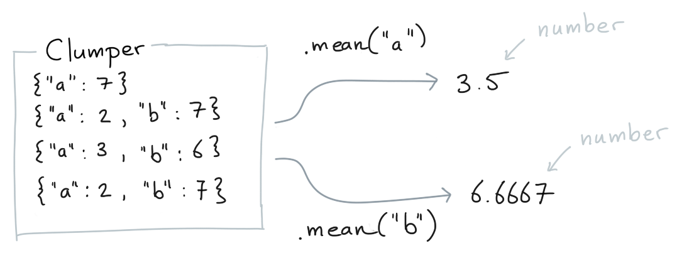
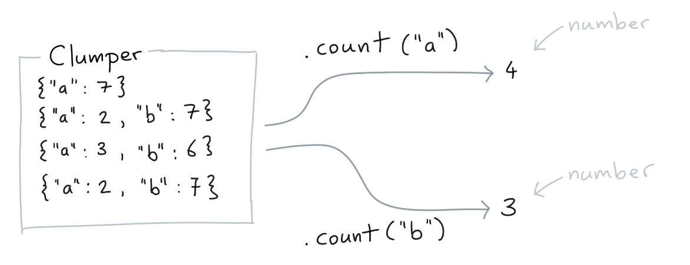
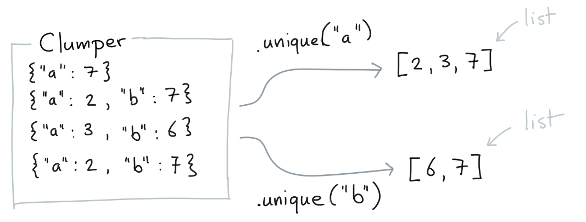
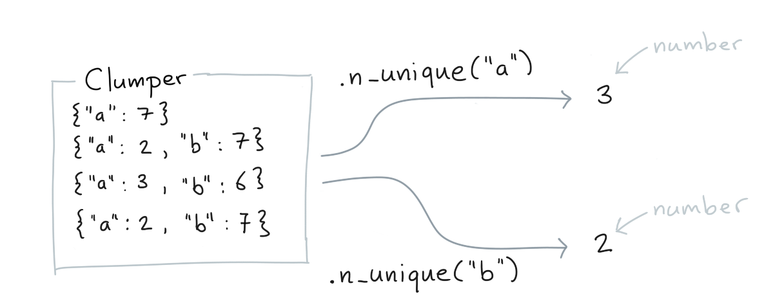
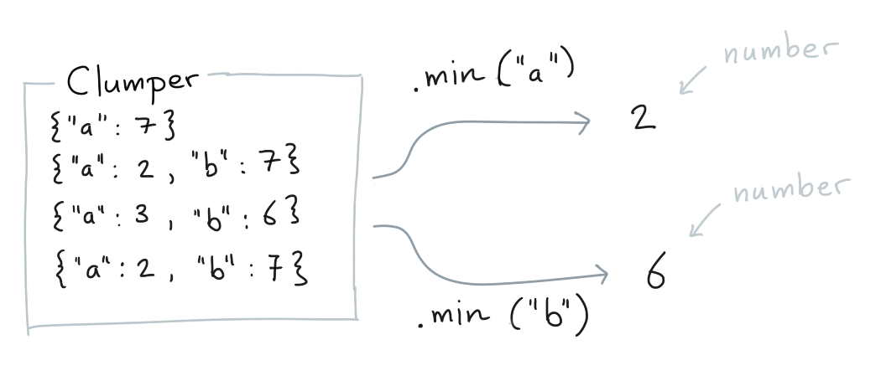

The `Clumper` object also offers useful methods that aren't verbs.

## Summary Methods

Here's a sample of useful methods to get summaries from your collection.
Each of these methods has a string equivalent that is used in `.agg()`
when making aggregations. We'll list a few common ones here but take note:
all of these are methods **ignore the grouping**. If you want to use these
methods with grouping, use `.agg()` instead.

### `.mean()`

You can calculate the mean of values for which a key exists.



```python
from clumper import Clumper

list_of_dicts = [
    {'a': 7},
    {'a': 2, 'b': 7},
    {'a': 3, 'b': 6},
    {'a': 2, 'b': 7}
]

Clumper(list_of_dicts).mean("a")
Clumper(list_of_dicts).mean("b")
```

### `.count()`

You can count the number of rows for which a key exists.



```python
from clumper import Clumper

list_of_dicts = [
    {'a': 7},
    {'a': 2, 'b': 7},
    {'a': 3, 'b': 6},
    {'a': 2, 'b': 7}
]

Clumper(list_of_dicts).count("a")
Clumper(list_of_dicts).count("b")
```

### `.unique()`

You can retreive all unique values for a certain key.



```python
from clumper import Clumper

list_of_dicts = [
    {'a': 7},
    {'a': 2, 'b': 7},
    {'a': 3, 'b': 6},
    {'a': 2, 'b': 7}
]

Clumper(list_of_dicts).unique("a")
Clumper(list_of_dicts).unique("b")
```

### `.n_unique()`

You can the number of unique values for a certain key.



```python
from clumper import Clumper

list_of_dicts = [
    {'a': 7},
    {'a': 2, 'b': 7},
    {'a': 3, 'b': 6},
    {'a': 2, 'b': 7}
]

Clumper(list_of_dicts).n_unique("a")
Clumper(list_of_dicts).n_unique("b")
```

### `.sum()`

You can calculate the sum of values for which a key exists.


```python
from clumper import Clumper

list_of_dicts = [
    {'a': 7},
    {'a': 2, 'b': 7},
    {'a': 3, 'b': 6},
    {'a': 2, 'b': 7}
]

Clumper(list_of_dicts).sum("a")
Clumper(list_of_dicts).sum("b")
```

### `.min()`

You can calculate the minimum of values for which a key exists.



```python
from clumper import Clumper

list_of_dicts = [
    {'a': 7},
    {'a': 2, 'b': 7},
    {'a': 3, 'b': 6},
    {'a': 2, 'b': 7}
]

Clumper(list_of_dicts).min("a")
Clumper(list_of_dicts).min("b")
```

### `.max()`

You can calculate the maximum of values for which a key exists.


```python
from clumper import Clumper

list_of_dicts = [
    {'a': 7},
    {'a': 2, 'b': 7},
    {'a': 3, 'b': 6},
    {'a': 2, 'b': 7}
]

Clumper(list_of_dicts).max("a")
Clumper(list_of_dicts).max("b")
```

## More?

If you'd like to see more information these methods check the API
of the `Clumper` object. That's where you'll find them.
