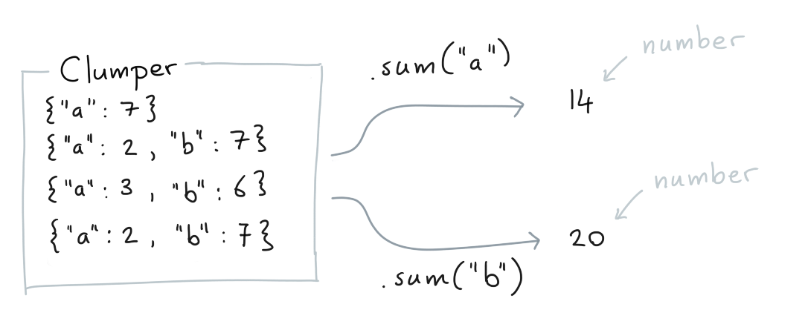
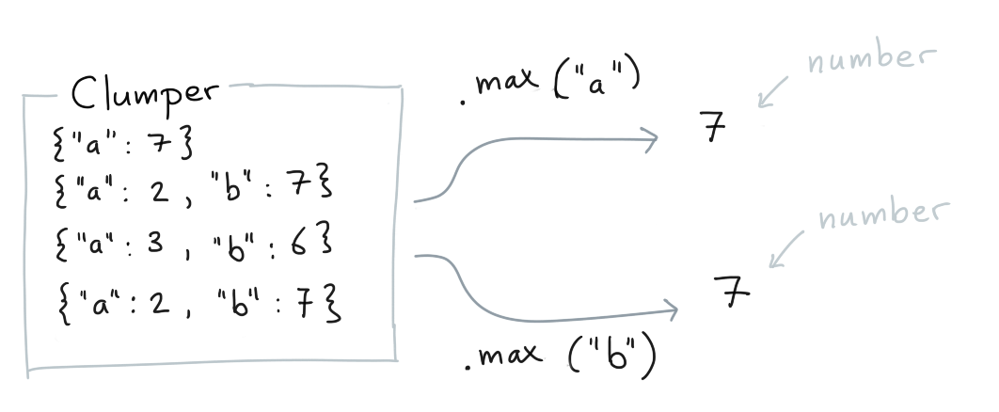

The `Clumper` object also offers useful methods that aren't verbs. In
particular there's a lovely set that can calculate summaries on keys.
Each of these methods has a string equivalent that is used in `.agg()`
when making aggregations. Here's a few common ones.

## Common Examples

### `.mean()`

You can calculate the mean of values for which a key exists.

### `.count()`

You can count the number of rows for which a key exists.

### `.unique()`

You can retreive all unique values for a certain key.

### `.n_unique()`

You can the number of unique values for a certain key.

### `.sum()`

You can calculate the sum of values for which a key exists.

### `.min()`

You can calculate the minimum of values for which a key exists.

### `.max()`

You can calculate the maximum of values for which a key exists.

## More?

If you'd like to see more information these methods check the API
of the `Clumper` object. That's where you'll find them.
