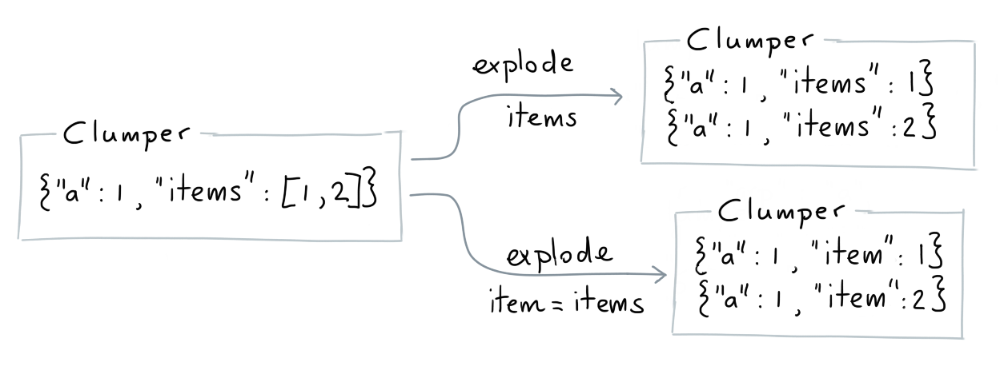

Because sequences of nested data really come in all sorts
of shapes and sizes this library offers verbs to help you
reshape the data into different formats. This document will
demonstrate how these verbs work.

## Explode

Sometimes you'll have data that is nested as a list of values.
If you'd like to expand such a list of values you can use
`.explode()`.



```python
from clumper import Clumper

data = [{'a': 1, 'items': [1, 2]}]

clumper = Clumper(data).explode("items")
assert clumper.equals([{'a': 1, 'items': 1}, {'a': 1, 'items': 2}])

new_data = Clumper(data).explode(item="items").collect()
assert clumper.equals([{'a': 1, 'item': 1}, {'a': 1, 'item': 2}])
```

Note how the syntax allows you to either explode the values
assigning they to the old keyname or to directly rename
this field. You can also pass multiple keys in a single command.

```python
from clumper import Clumper

data = [{'a': 1, 'items': [1, 2], 'values':[3, 4]}]

clumper = Clumper(data).explode("items", "values")
expected = [
    {'a': 1, 'items': 1, 'values': 3},
    {'a': 1, 'items': 1, 'values': 4},
    {'a': 1, 'items': 2, 'values': 3},
    {'a': 1, 'items': 2, 'values': 4}
]
assert clumper.equals(expected)

new_data = Clumper(data).explode(item="items", val="values").collect()
expected = [
    {'a': 1, 'item': 1, 'val': 3},
    {'a': 1, 'item': 1, 'val': 4},
    {'a': 1, 'item': 2, 'val': 3},
    {'a': 1, 'item': 2, 'val': 4}
]
assert clumper.equals(expected)
```
