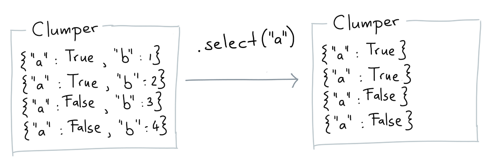
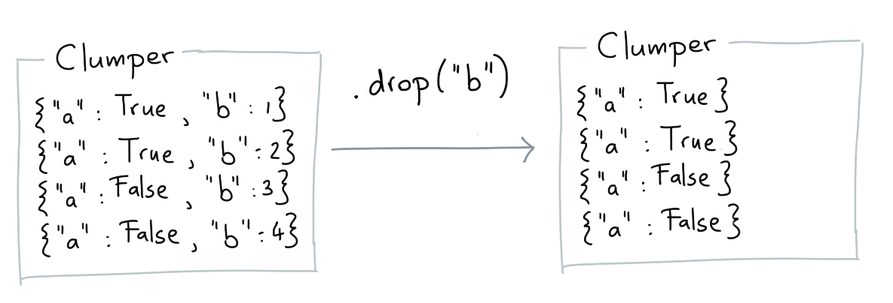
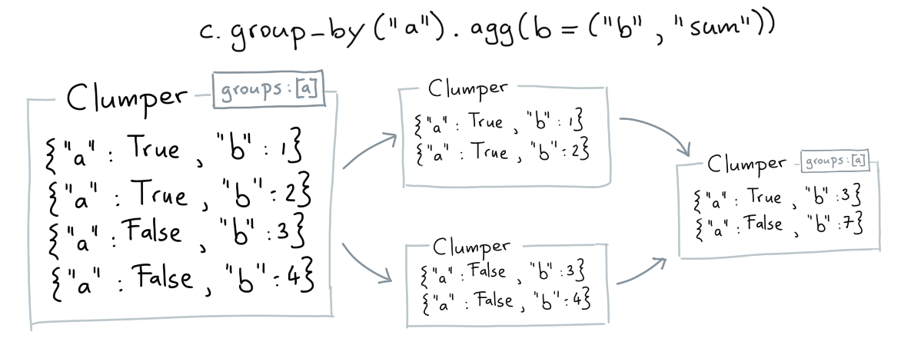

This document is to help give you an overview of what kind of verbs are in this library.

## What are Verbs?

In this library verbs are special kinds of methods. They really are
just methods in essense but they imply a general pattern. In `Clumper`,
a verb is a method that;

1. Always returns a `Clumper` back, so it's chain-able.
2. Has a name that tells you *what* is happening to the data while
the parameters tell you *how* it is changing the data.

This combination of properties allows you to write code in the same
way you'd explain the steps to a human. Take this code for example.

```python
from clumper import Clumper

list_of_dicts = [
    {'a': 7, 'b': 2},
    {'a': 2, 'b': 4},
    {'a': 3, 'b': 6}
]

(Clumper(list_of_dicts)
  .mutate(c = lambda d: d['a'] + d['b'])
  .sort(lambda d: d['c']))
```

Schematically, this is what the code does.

### Mutate

First we use the **mutate** verb. This allows us to add values to pairs in
our collection.


The output of this step is another `Clumper` collection.

### Sort

Next we pick up the mutated collection and we apply a sort to it.


Again, the output of this another `Clumper`. This means that we can
keep adding steps as we further our analysis.

### Method Chaining

This style of programming is really powerful and it keeps you productive
once you've gotten a hang of the lambda functions. The lambda functions
that you pass in can be general python. This also means that you're free
to use nested dictionaries, sets or whatever you like doing in python.

## Common Verbs

Here's a list of the verbs that you'll most likely use the most.

### Keep

The **keep** verb allows you to grab a subset from the original collection.


### Mutate

The **mutate** verb allows you to add/overwrite data to each item in the collection.


### Sort

The **sort** verb allows you to sort the collection based on values of items.


### Select

The **select** verb allows you to select a subset of keys for each item.



### Drop

The **select** verb allows you to remove a subset of keys for each item.



### Group By

The **group_by** verb allows you to set a group on a collection based on
the values of the keys that you pass. The groups represent subsets and
certain verbs will change their behavior if there are groups present.

The main use-case for this verb is in combination with **.agg()**.


### Ungroup

The **ungroup** verb will remove any groups currently present.


### Agg

The **agg** verb is short for aggregate. They allow you to summarise the data,
keeping in mind any groups that are on it.



When defining a summary to apply you'll need to pass three things:

1. the name of the new key
2. the key you'd like to summarise (first item in the tuple)
3. the summary you'd like to calculate on that key (second item in the tuple)

The following aggregation functions are available: `mean`, `count`, `unique`,
`n_unique`, `sum`, `min` and `max`. For more information on how they work you
can read more info [here]().
